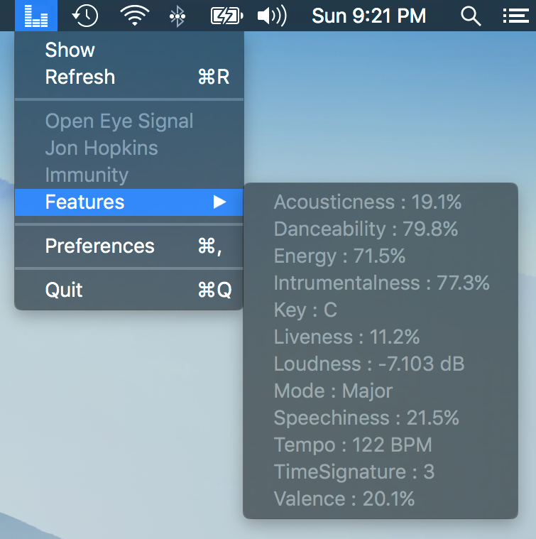
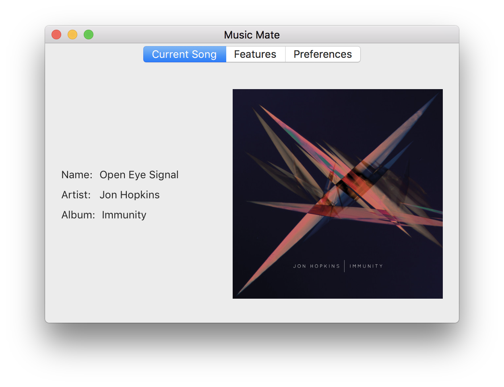

# Music Mate

Music Mate is a macOS menu bar application for fetching [features](https://developer.spotify.com/web-api/get-audio-features/)
from your currently playing song on Spotify.

<table border="0">
  <tr>
    <td></td>
    <td></td>
  </tr>
</table>

<sub>Note: The app uses your browser to authenticate with Spotify on startup. This is due to the deprecation of 
Spotify's legacy desktop SDK. Once their new SDK is available, this will no longer be a requirement.</sub>

## Building

There are a few steps to set up a new machine for development.

1. **Create Spotify Developer Application** - First, you'll need a (free) [Spotify Developer Account](developer.spotify.com). Once you've created one, go to the 
My Applications page and create a new application. Add a `http://localhost:5050/auth-callback` as a redirect URI
and copy the client ID from this page as well.

2. **Save Client ID** - Once you've cloned the project, you'll need to create a file in the "Music Mate" subfolder
called ".client-id" that contains one line with only client ID that you saved in the previous step.

3. **Dependencies** - Finally, check out the cocoapod dependencies with `pod update`.

Example:
```
# Clone
git clone git@github.com:jbruce2112/music-mate.git

cd music-mate

# Create id file
echo '<yourClientID>' > Music\ Mate/.client-id

# Check out dependencies
pod update
```

Once the these steps are done, open the project using the `Music Mate.xcworkspace` file.

## License
The code is licensed under the MIT license. The various icons are not. 
They are provided by [Icons8](https://icons8.com) and licensed under the 
[Creative Commons Attribution-NoDerivs 3.0 Unported](https://creativecommons.org/licenses/by-nd/3.0/) license.
